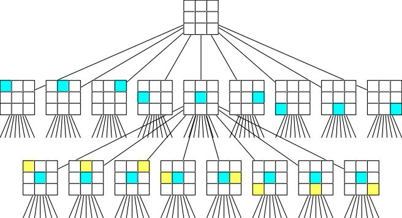

# Tic-Tac-Toe
author : happystick 
mail-id : sasankyadati@gmail.com 
last mod. :27/03/2017 

# Introduction
Tic-Tac-Toe is a two player game, X and O, who take turns marking the spaces in a 3x3 grid. Each player takes turns, first X, and then O. The player who succeeds in placing three of their marks in a horizontal, vertical, or diagonal row first wins the game. The game always ends with a win-lose or a draw situation. 
 

# Game play
Each player takes turns, first X, and then O. The goal is to get three in a row in a 3x3 board. Each player on their turn can mark only an empty cell with their corresponding mark (X or O). The game ends with a win-lose or a draw situation.
 

# Game in Numbers
So, how many Tic-Tac-Toe games are possible? This is a simple question solvable with a little brute force and basic combinatory techniques. It is quite obvious that the answer is towards the south of 9!. Total number of possible games is equal to the sum of the number of games that end on the 5th move, 6th move, 7th move, 8th move and the 9th move. A brief calculation of this sum results in 255,168. These calculations do not take symmetry of the board into consideration. It is also interesting to note that most games end in a draw (always, if both players play optimally).
 

# Game Environment
Tic-Tac-Toe is an adversarial environment. Adversarial environment refers to a competitive environment where each player’s goal is to minimize the opponent’s score and thereby maximize their own score. 
 
Hence, this game belongs to a class of adversarial search problems where our aim is to find a way (solution) to maximize our score in the presence of an adversary who is planning against us. In particular, Tic-Tac-Toe is a two player environment. It follows turn taking which means actions of a player are taken one followed by the other. Moreover, this game is a zero sum game, meaning, the sum of the utilities (scores) of the players at the end of the game is constant for every game.
 

# Let's Formally Define The Game!
We define the game to be a formal search problem with the following elements.
 
<h4> •	S O </h4>
 
The initial state, which specifies how the game is setup at start.In Tic-Tac-Toe, this represents a 3x3 board with all the cells empty.
 

<h4>•	PLAYER ( s ) </h4>
 
Defines which player has the move in the given state s.
 

<h4>•	ACTIONS ( s ) </h4>
 
Returns the set of legal moves in the state s.
 

<h4>•	RESULT ( s , a ) </h4>
 
Also known as the transitional model, returns the resulting state s’ on selecting move a in the state s.
 

<h4>•	TERMINAL-TEST ( s ) </h4>
 
Returns true, when the game is over and false otherwise.
 

<h4>•	UTILITY ( s , p ) </h4>
 
Returns the utility / score of player p in the terminal state s.   In Tic-Tac-Toe, the possible utility values are 0 (draw), +1 (win) and -1 (lose).
 

# Game Tree
The initial state, ACTIONS(s) and RESULT(s,a) together define the game tree with the initial state as the root of the tree. We use the term search tree to describe a tree that is superimposed on the game tree and examines enough nodes to determine what move to make. Following figure shows a partial game tree.
  

 

# The Random Decision Algorithm
The random decision making algorithm is very straightforward and simple. At each of its turns, the bot calculates all the valid moves in the current state and chooses one of these valid actions in random. This strategy is clearly not optimal. However, we would like to use this algorithm and compare its moves with those of the minimax algorithm.
 

# The Minimax Algorithm
Let us call the two players MAX and MIN, for reasons that will soon become obvious. MAX moves first and then take turns moving until the game is over. At the end, points are awarded to the winner and penalties are given to the loser. Our objective is to find a sequence of actions that would lead the desired player to a terminal state of maximum utility. But, in games involving more than one player, other players have something to say about it. So, all the moves MAX can make are dependent on the moves taken by MIN. Therefore, MAX must find a strategy which specifies MAX’s move in the initial state, and then MAX’s moves in the states resulting from every possible move by MIN and so on until the game ends.
 

An optimal strategy maximizes the worst case outcome of the game for the computer, assuming optimal play. The definition of optimal play assumes that the opponent also plays optimally.
 

Given a game tree, the optimal strategy can be determined from the minimax value of each node, which we write as minimax(n).
 

The minimax value of a node is defined as the utility for MAX of being in the corresponding state, assuming that both players play optimally from there to the end of the game.
 

What if MIN does not play optimally? It is easy to show that MAX will do even better.
 

MAX prefers to move to a state of maximum minimax value and MIN prefers to move to a state of minimum minimax value.¬¬¬¬
Mathematically, it is defined as follows.
 
MINIMAX(s)= 
{
 
    UTILITY(s)                                  if TERMINAL-TEST(s) 
    @max⁡(a ∈ ACTIONS(s))  MINIMAX(RESULT(s,a))  if PLAYER(S)=MAX  
    @min⁡(a ∈ ACTIONS(s))  MINIMAX(RESULT(s,a))  if PLAYER(S)=MIN   
}
 

The above function returns best possible move under the assumption that the opponent plays to minimize utility. The function goes through the entire game tree, all the way to the leaves to determine the minimax value of given state.
 

MINIMAX algorithm performs complete depth first exploration of the game tree. If the maximum depth of the tree is m (9 for Tic-Tac-Toe) and there are b (5 for Tic-Tac-Toe) legal moves at each node, then the time complexity of MINIMAX algorithm is O(bm) and the space complexity is O(m). Due to this exponential time complexity, this algorithm is impractical for games that are moderately more complex than Tic-Tac-Toe. Isn’t that off putting? Maybe it is. However, this algorithm serves as the basis for the mathematical analysis of games and for other practical algorithms.
 

 
# References
Game in Numbers - <i>http://www.se16.info/hgb/tictactoe.htm</i> 
Peter Norvig & Stuart Russell - Artificial Intelligence : A Modern Approach (3rd edition)  
Game Tree - <i>http://www.devx.com/dotnet/Article/34912</i> 

